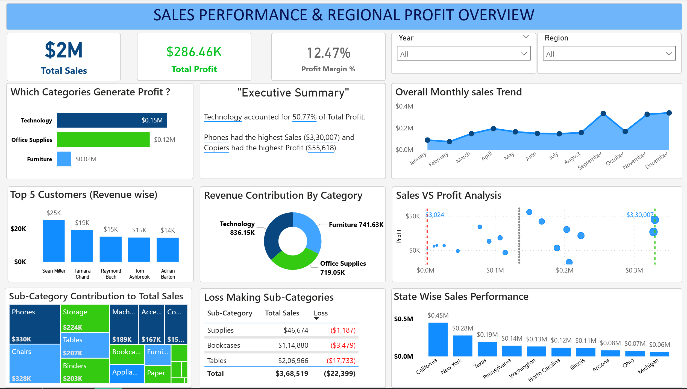
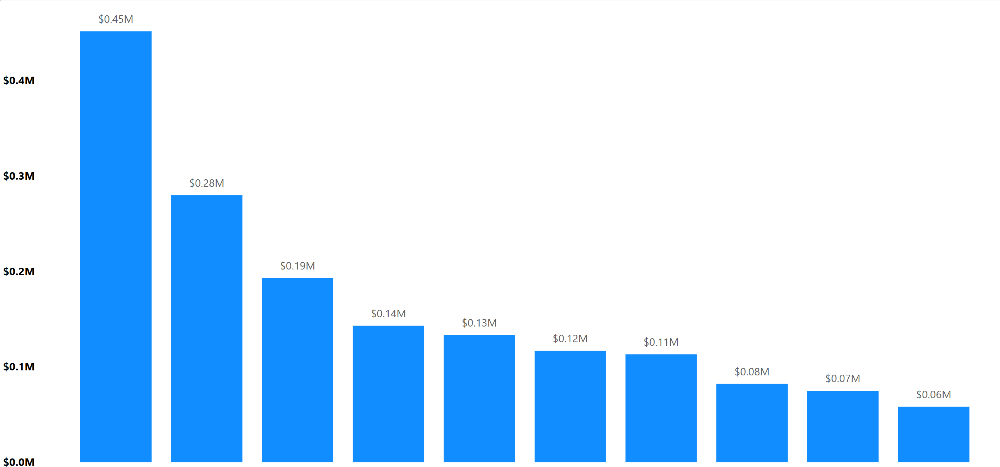
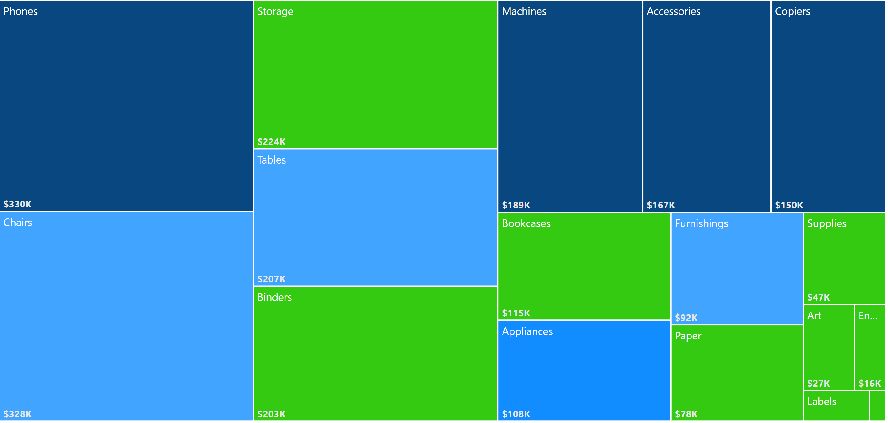

# Power BI Sales Dashboard
This project presents an interactive dashboard build in Power BI using Superstore sales dataset to analyze business performance and identify important sales trends.

## Skills used
- Data visualization
- Dashboard design
- Data modeling
- Power BI filters and slicers
- sales performance analysis

## Dashboard preview

## State wise sales

## Total sales by Sub-Category

## Dashboard Insights
- Sales trend over time
- Regional sales performace
- Product category and sub-category analysis
- Customer segment insights
- Loss making sub-category

## Project Structure
powerbi-sales-dashboard
|-
| - ___Screenshots
| - ___README.md
| - ___Sales_performance_&_regional_profit_overview.pbix

## Goal
To create an interactive dashboard that helps visualize sales performance and allows users to explore key business metrics such as revenue trends, regional performance and product category sales.
